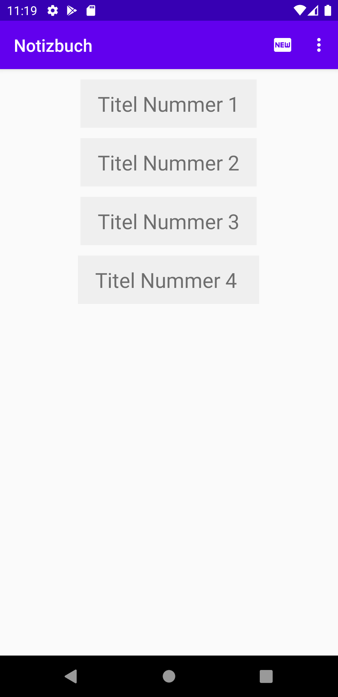
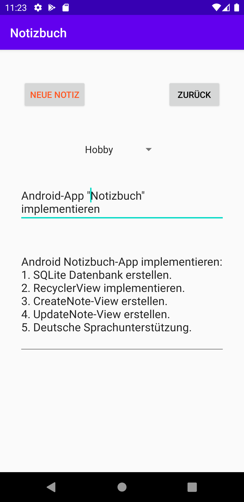
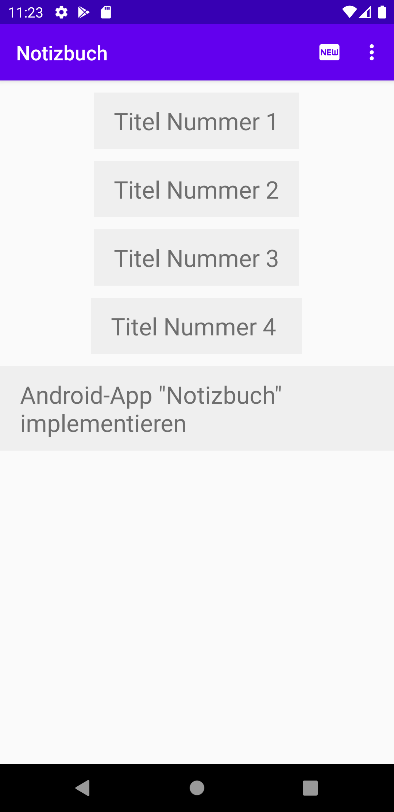
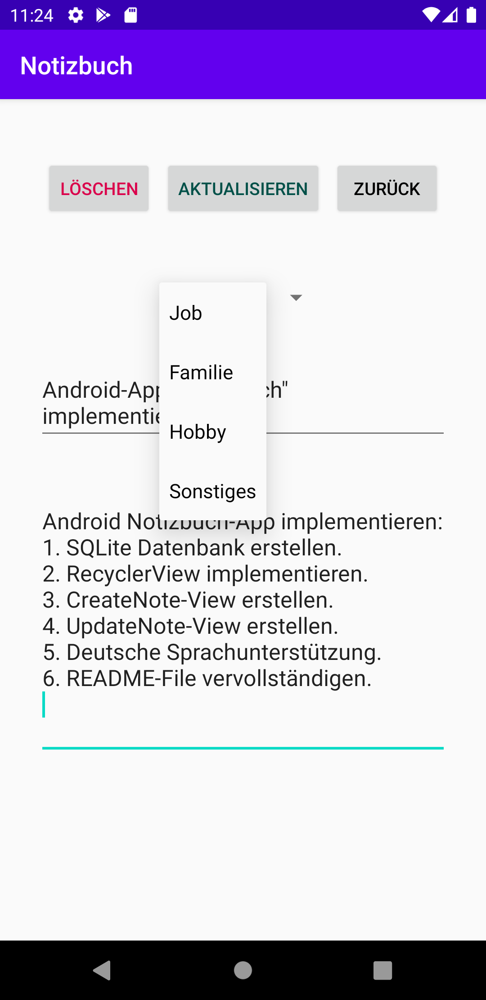
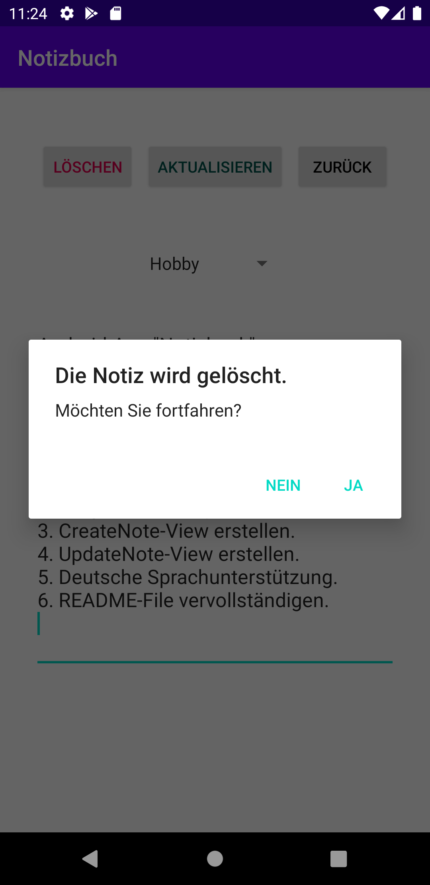

## Notizbuch-App
Einfache Android Notizbuch-App. Verwendet SQLite als Datenbank 
und [Android-RecyclerView](https://developer.android.com/guide/topics/ui/layout/recyclerview) 
für die Notizliste.

